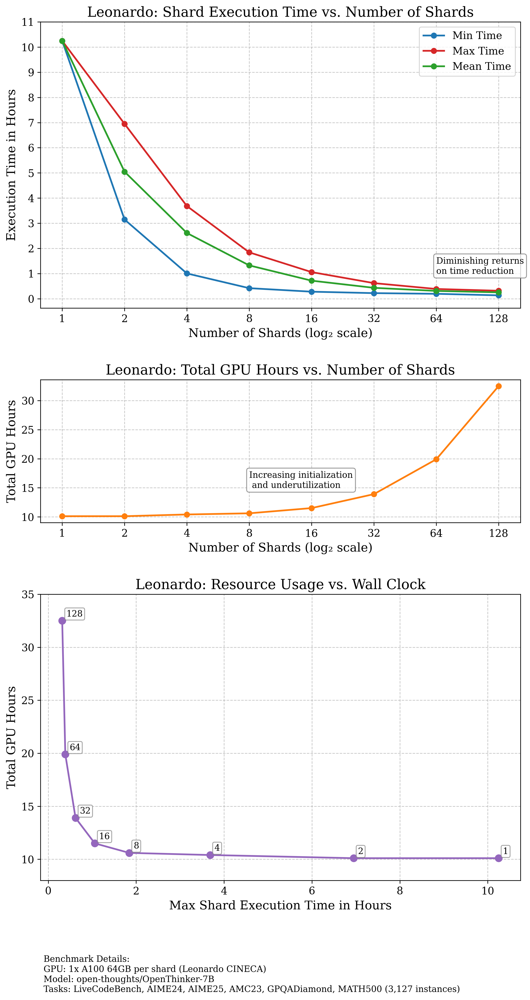

# Distributed Evaluation for Evalchemy

This document explains how to run distributed, data parallel evaluations on HPC clusters (which also sometimes don't have internet access on gpu nodes).

## Quickstart

### Using the Distributed Setup

The distributed evaluation system allows you to run model evaluations in parallel across multiple nodes on a computing cluster, dramatically reducing the time needed to evaluate models on large benchmarks.

1. **Basic workflow**:
   - Create a dataset of queries/prompts
   - Distribute the dataset across multiple nodes
   - Run model inference in parallel on each shard
   - Collect and merge the results
   - Calculate metrics and upload to database

2. **Example command**:
   ```bash
   python eval/distributed/launch.py --model_name open-thoughts/OpenThinker-7B --tasks LiveCodeBench,AIME24,AIME25,AMC23,GPQADiamond,MATH500 --num_shards 8 --max-job-duration 2 --watchdog
   ```

3. **Launch script arguments**:
   - `--tasks`: Comma-separated list of tasks to evaluate (e.g., "LiveCodeBench,AIME24")
   - `--model_name`: HuggingFace model ID to evaluate
   - `--num_shards`: Number of shards for distributed evaluation
   - `--max-job-duration`: Maximum job duration in hours
   - `--watchdog`: Monitor job progress and compute scores when done (recommended)

4. **Cluster Auto-Detection**

   The system automatically detects which cluster you're running on by checking the hostname and configures the appropriate:
   - HuggingFace cache location
   - Conda environment
   - SLURM batch script template

### Setup Commands by Cluster

#### Capella

```bash
source /data/horse/ws/ryma833h-DCFT_Shared/miniconda3/bin/activate
conda activate evalchemy
cd /data/horse/ws/ryma833h-DCFT_Shared/evalchemy
```

#### Leonardo

```bash
source /leonardo_work/EUHPC_E03_068/DCFT_shared/mamba/bin/activate /leonardo_work/EUHPC_E03_068/DCFT_shared/evalchemy/env/cpu-evalchemy
cd /leonardo_work/EUHPC_E03_068/DCFT_shared/evalchemy/
```

For instructions on setting up a new cluster environment, see the [Adding a New Environment](#adding-a-new-environment) section below.

For detailed setup instructions for specific clusters, see:
- [Leonardo Setup](SETUP_LEONARDO.md)
- [Capella Setup](SETUP_CAPELLA.md)

## Distributed Evaluation

### How It Works

1. **Dataset Preparation**:
   - The launcher creates or reuses a cached dataset for the selected tasks
   - It generates a unique task hash for each set of tasks
   - This dataset is uploaded to HuggingFace Hub for distributed access

2. **Job Submission**:
   - The launcher creates a customized sbatch script for the detected cluster
   - It submits an array job with the specified number of shards
   - Each shard processes a non-overlapping subset of the evaluation dataset

3. **Model Inference**:
   - Each worker node:
     - Loads the model (using vLLM for efficient inference)
     - Processes its assigned data shard
     - Applies the appropriate chat template
     - Generates outputs with the specified sampling parameters
     - Saves results to a local parquet file

4. **Result Collection**:
   - When using `--watchdog`, the launcher monitors job progress
   - Once all shards complete, results are uploaded to HuggingFace Hub
   - Metrics are calculated and stored in the database

### Precomputed Answers

The distributed evaluation system creates precomputed answers that can be reused:

- Results are stored as parquet files in HuggingFace datasets
- These precomputed answers can be evaluated with different metrics later
- They can be inspected on the HuggingFace data studio
- Metrics are added to the repo README for easy viewing

## Benchmarking Performance

Before deploying at scale, it's important to benchmark your distributed evaluation setup to determine the optimal number of shards for your workload. This helps balance execution time against resource efficiency.

### Running Benchmarks

Use the following command to benchmark with different shard counts:

```bash
# Replace N with the number of shards to test (e.g., 2, 4, 8, 16, 32, 64, 128)
SHARDS=N && python eval/distributed/launch.py --model_name [model-name] --tasks [task-list] --num_shards $SHARDS --watchdog
```



### Benchmarking Results Analysis

When analyzing benchmark results, look for:

1. **Diminishing returns on time reduction**: The point where adding more shards produces minimal time savings
2. **Resource efficiency**: Total GPU hours used across all shards (lower is better)
3. **Initialization overhead**: As shards increase, the time spent loading models and libraries becomes significant
4. **Utilization**: At higher shard counts, vLLM might not fully utilize GPU resources due to smaller batch sizes per shard and increased overhead

## Adding a New Environment

To add support for a new HPC cluster:

1. **Manual Testing**:
   - First ensure you can run the evaluation "manually" on a single node
   - Test with an interactive session:
     ```bash
     # Request an interactive node
     salloc --nodes=1 --ntasks-per-node=1 --gres=gpu:1 [other cluster-specific options]
     
     # Test model loading and inference
     python eval/distributed/process_shard.py --global_size 1 --rank 0 --input_dataset [dataset-id] --model_name [model-path] --output_dataset [output-dir]
     ```

2. **Update Launch Script**:
   - Modify `eval/distributed/launch.py` to add hostname detection for your cluster
   - Add the appropriate paths for:
     - HF_HUB_CACHE
     - Python environment
     - Activation commands

3. **Create SBATCH Script**:
   - Create a new file `eval/distributed/process_shards_[cluster].sbatch`
   - Include cluster-specific configurations:
     - Partition and account information
     - Module loading commands
     - Environment setup
     - Path configurations

4. **Benchmark Performance**:
   - Run the benchmark command with different shard counts
   - Analyze the trade-off between execution time and total GPU hours
   - Set an optimal default in `launch.py` based on your results

5. **Document Setup**:
   - Create a detailed setup guide (`SETUP_[CLUSTER].md`)
   - Include all necessary setup steps
   - Document any cluster-specific quirks or requirements
   - Add benchmarking results and insights